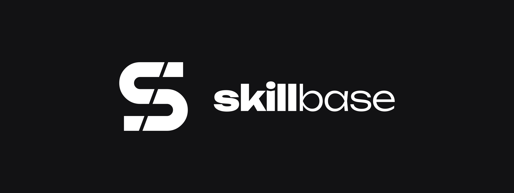
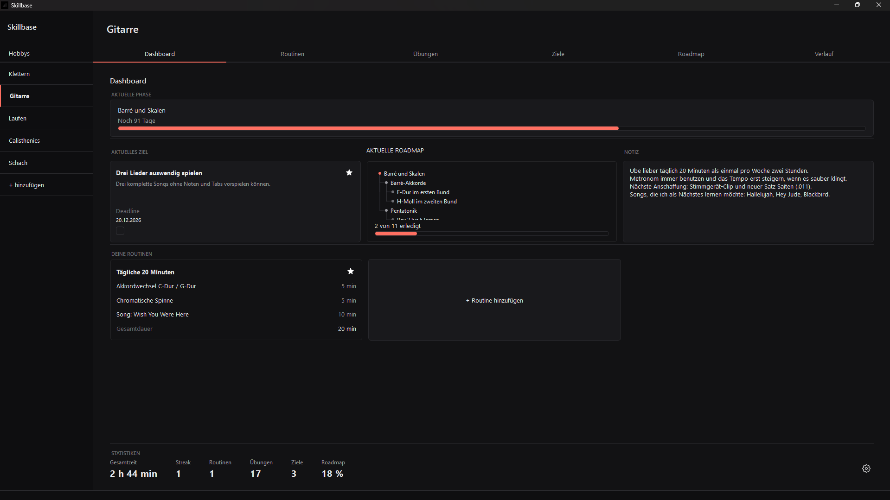
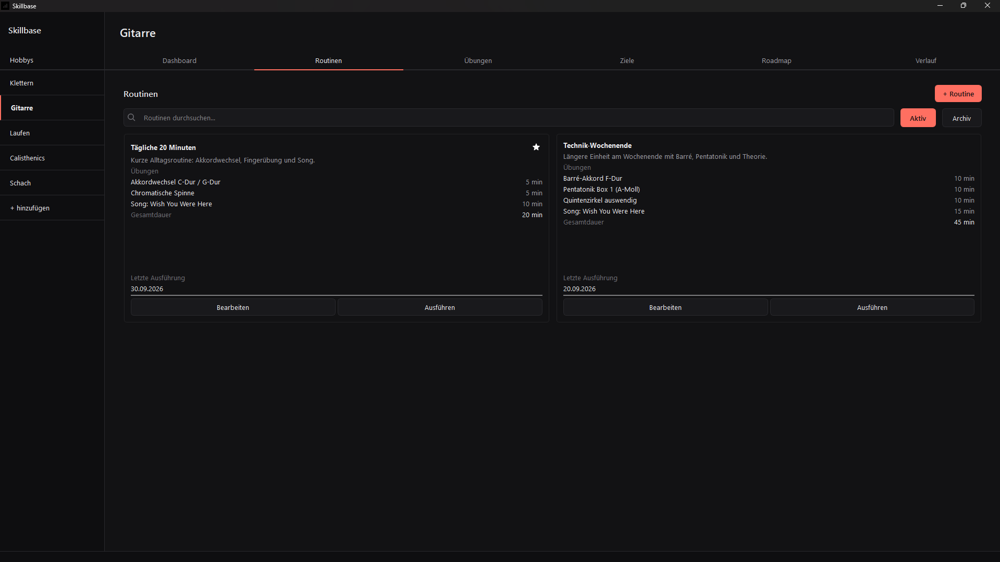
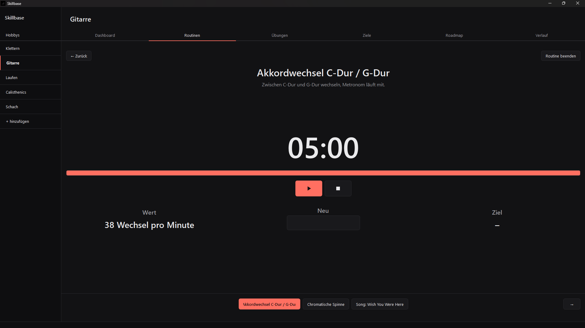
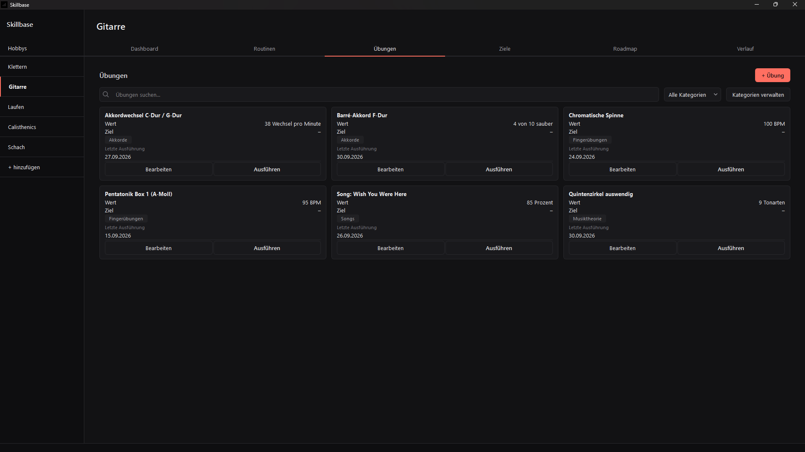
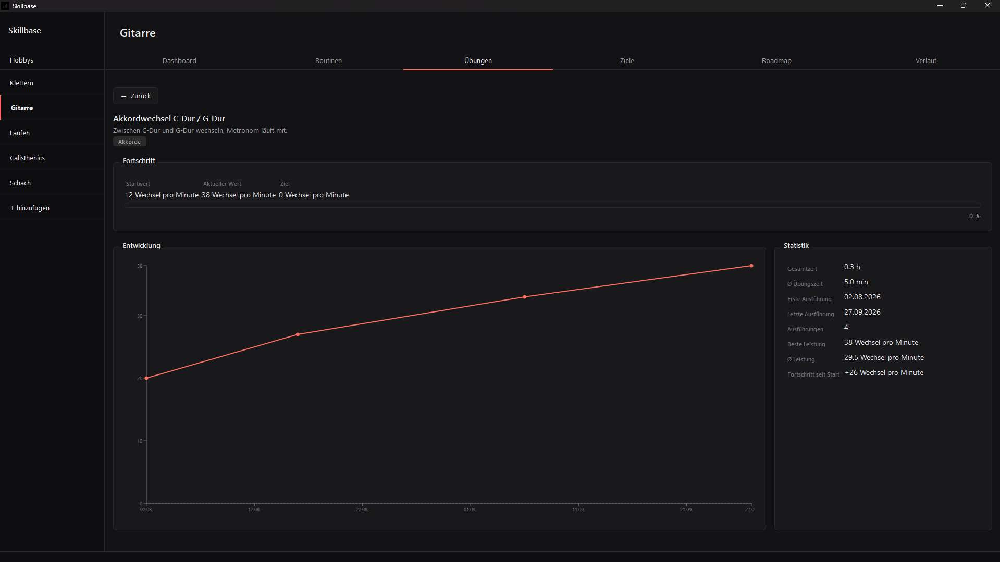
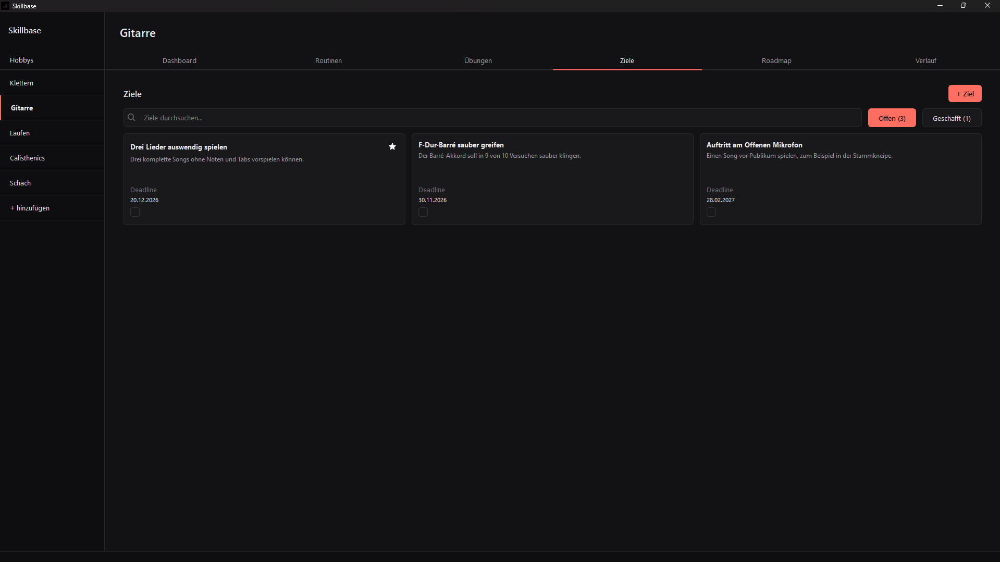
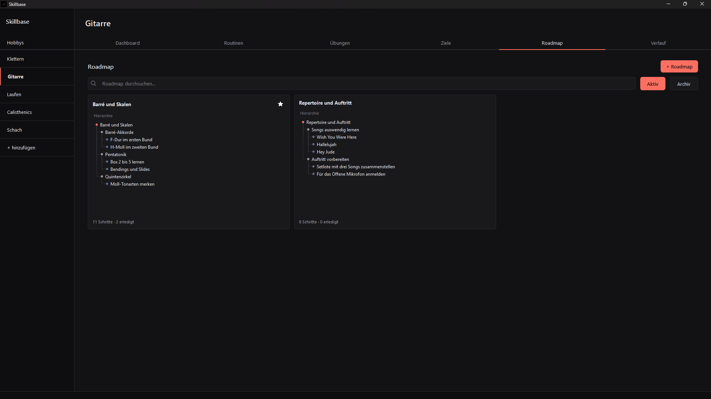
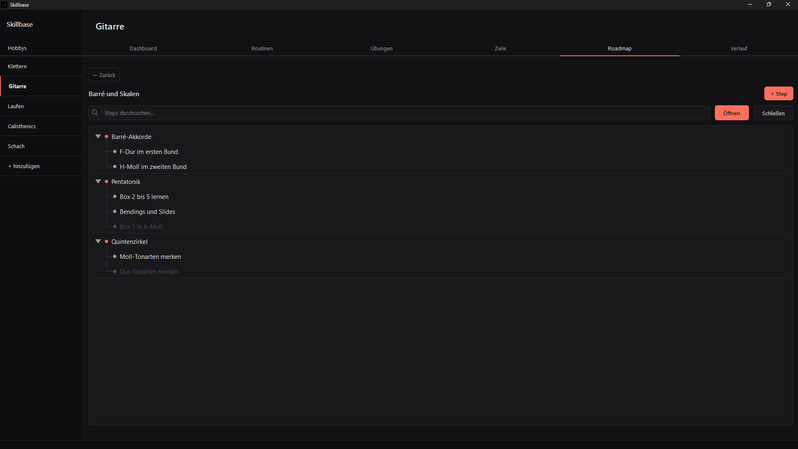
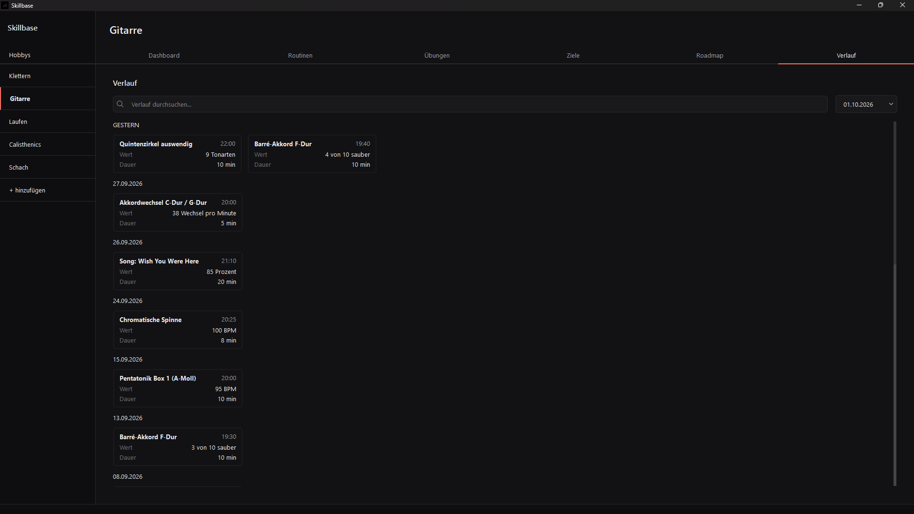

# Skillbase

<p align="center">
  
</p>

**Skillbase** is a local desktop application for organizing and developing personal hobbies and skills over the long term — built with C++ and Qt 6.

> Skillbase should always show me what I've achieved, where I currently stand, what I should work on next, and where I want to go long-term — without overloading me with unnecessary features.

## Motivation

Unlike general-purpose tools like Notion or Obsidian, Skillbase doesn't aim to offer as many features as possible. Instead, it's deliberately narrow: everything in the app exists to answer four questions about a skill or hobby the user is developing:

- What have I already achieved?
- Where do I currently stand?
- What should I work on next?
- Where do I want to go long-term?

Skillbase runs entirely locally, with no required cloud services, subscriptions, or AI features.

## Features

| Area | Description |
|---|---|
| **Hobbies** | Create, rename, and delete any number of hobbies. Each hobby has its own color and its own set of learning data. |
| **Dashboard** | Central overview of a hobby: current phase, main goal, current roadmap, notes, and key statistics at a glance. |
| **Goals** | Collect individual goals for a hobby with optional deadline. One open goal can be marked as the current main goal and is then shown on the dashboard. |
| **Roadmap** | Build a hierarchical learning plan for each hobby with multiple steps and arbitrarily nested sub-steps. One roadmap can be marked as the current roadmap. |
| **Timeline** | Plan learning phases for a hobby using start and end dates. Phases are ordered by date and cannot overlap. |
| **Exercises** | Create, edit, run, and archive reusable exercises belonging to a hobby. Each exercise can have a target value, unit, and a progress chart. |
| **Routines** | Create timed training sessions from existing exercises, with a custom order and duration for each exercise. |
| **Timer** | Run timed exercises and routines with an audio signal when a timer finishes. |
| **History** | Browse all completed exercises and routines grouped by day. Filterable by date and by exercise name. |
| **Notes** | Store free-form notes per hobby directly on the dashboard. |
| **Hobby settings** | Rename or delete a hobby, including all of its exercises, routines, goals, roadmaps, phases, notes, and logs. |
| **Statistics** | Track total time, streak, active routines, exercise executions, open goals, and roadmap progress per hobby. |

## Architecture

Skillbase follows a layered architecture with a clear separation of concerns:

```text
┌─────────────────────────────┐
│           Qt UI             │
│  Qt Widgets + MainWindow    │
│  (UI + Application Logic)   │
└──────────────┬──────────────┘
               ▼
┌─────────────────────────────┐
│        Data Layer           │
│   Repository Pattern /      │
│        Qt SQL               │
└──────────────┬──────────────┘
               ▼
┌─────────────────────────────┐
│          SQLite             │
└─────────────────────────────┘
```

Design decisions and further detail: [`docs/architecture.md`](docs/architecture.md)

## Data model

The full entity-relationship model (hobbies, exercises, routines, goals, roadmaps, logs) lives in [`docs/er-diagram.md`](docs/er-diagram.md).

## Tech stack

- **Language:** C++
- **GUI:** Qt 6, Qt Widgets, Qt Designer
- **Database:** SQLite via Qt SQL
- **Build system:** CMake
- **Tooling:** Qt Creator, Visual Studio Code

## Getting started

### Requirements

- Qt 6 (including the Qt SQL module)
- CMake ≥ 3.16
- A C++17-capable compiler (MinGW, MSVC, or Clang)

### Build

```bash
git clone https://github.com/ItsDylan255/Skillbase.git
cd Skillbase
cmake -B build -DCMAKE_PREFIX_PATH="C:/Qt/6.11.2/mingw_64"
cmake --build build
```

On macOS or Linux, adjust `CMAKE_PREFIX_PATH` to your local Qt installation path.

### Run

```bash
./build/Skillbase        # Linux / macOS
build\Skillbase.exe      # Windows
```

On first launch, the application automatically creates a local SQLite database.

## Project structure

```text
Skillbase/
│
├── src/                  # Implementation (.cpp)
├── include/              # Headers (.h)
├── resources/            # Qt Designer .ui files, QSS, icons, audio
├── docs/                 # Architecture, data model, screenshots
│   ├── architecture.md
│   ├── er-diagram.md
│   └── screenshots/
│
├── CMakeLists.txt
├── README.md
└── LICENSE
```

## Known limitations

Skillbase is a personal project under active development. The following areas are known to be incomplete or intentionally simple:

- No multi-user support — the local SQLite database stores a single user's data.
- No sync or backup — data lives only on the machine where the app runs.
- No import/export between devices.
- Roadmap steps have no descriptions or deadlines, by design — they are intentionally lightweight.
- Routine execution saves values per exercise but does not yet enforce a target value on save.

## License

This project is licensed under the [MIT License](LICENSE).

---

## Screenshots

### Dashboard


### Routines


### Routine execution


### Exercises


### Exercise progress


### Goals


### Roadmap


### Roadmap detail


### History
