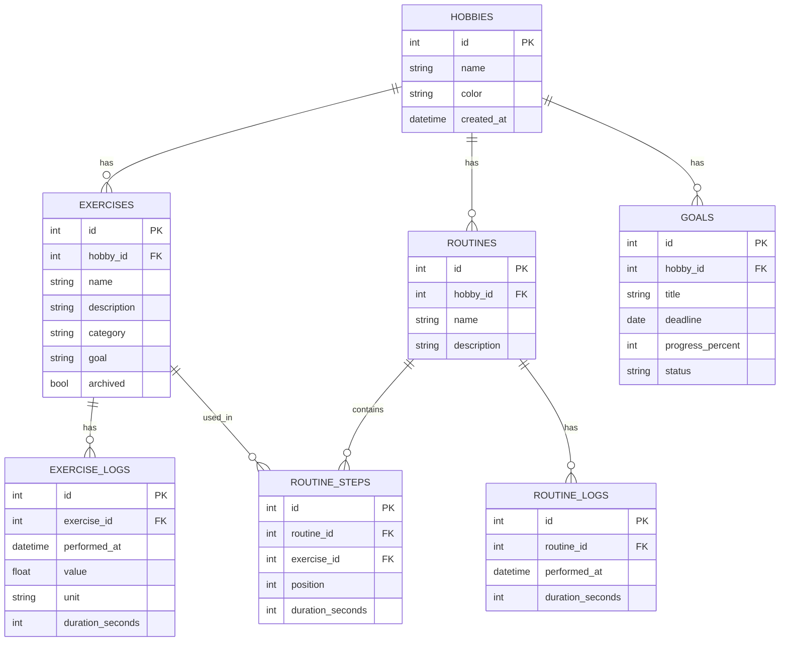

# Data model

Entity-relationship diagram for Skillbase's core tables. Render this on GitHub automatically, or paste the code block into the [Mermaid Live Editor](https://mermaid.live).

## Notes

- `routine_steps` is the join table between `routines` and `exercises`. It carries its own `position` (order within the routine) and `duration_seconds` (how long the exercise runs in *this* routine, independent of the exercise itself).
- `exercise_logs` uses a generic `value` + `unit` pair rather than named columns, so the same table works for BPM, minutes, repetitions, etc. This is a deliberate simplification: it doesn't support logging multiple simultaneous measurements (e.g. weight *and* reps in one set). Revisit with a child table (`exercise_log_values`) only if that's actually needed.
- `category` currently lives as a plain text field on `exercises` rather than its own table. Promote it to a `categories` table only if categories need to be managed independently (renamed, reused across hobbies, etc.).
- Hobbies are identified by name and color only — no icon field. Custom hobby icons were considered and deliberately dropped from scope.
- Milestones were considered as a separate table but deliberately dropped from scope; achieved goals are tracked via `goals.status`.
