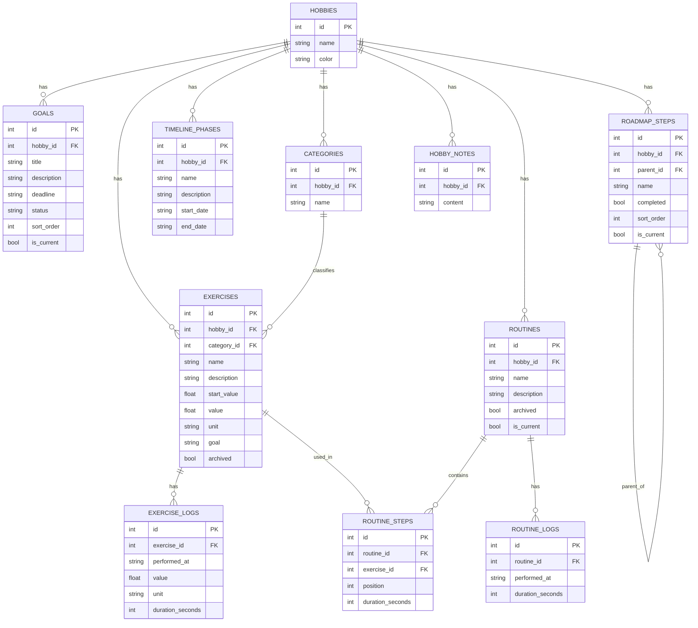

# Data model

Entity-relationship diagram for Skillbase's core tables. Render this on GitHub automatically, or paste the code block into the [Mermaid Live Editor](https://mermaid.live).

```mermaid
erDiagram
  HOBBIES ||--o{ EXERCISES : has
  HOBBIES ||--o{ ROUTINES : has
  HOBBIES ||--o{ GOALS : has
  HOBBIES ||--o{ ROADMAP_STEPS : has
  HOBBIES ||--o{ TIMELINE_PHASES : has
  HOBBIES ||--o{ CATEGORIES : has
  HOBBIES ||--o{ HOBBY_NOTES : has
  EXERCISES ||--o{ EXERCISE_LOGS : has
  EXERCISES ||--o{ ROUTINE_STEPS : used_in
  ROUTINES ||--o{ ROUTINE_STEPS : contains
  ROUTINES ||--o{ ROUTINE_LOGS : has
  CATEGORIES ||--o{ EXERCISES : classifies
  ROADMAP_STEPS ||--o{ ROADMAP_STEPS : parent_of

  HOBBIES {
    int id PK
    string name
    string color
  }
  HOBBY_NOTES {
    int id PK
    int hobby_id FK
    string content
  }
  CATEGORIES {
    int id PK
    int hobby_id FK
    string name
  }
  EXERCISES {
    int id PK
    int hobby_id FK
    int category_id FK
    string name
    string description
    float start_value
    float value
    string unit
    string goal
    bool archived
  }
  EXERCISE_LOGS {
    int id PK
    int exercise_id FK
    string performed_at
    float value
    string unit
    int duration_seconds
  }
  ROUTINES {
    int id PK
    int hobby_id FK
    string name
    string description
    bool archived
    bool is_current
  }
  ROUTINE_STEPS {
    int id PK
    int routine_id FK
    int exercise_id FK
    int position
    int duration_seconds
  }
  ROUTINE_LOGS {
    int id PK
    int routine_id FK
    string performed_at
    int duration_seconds
  }
  GOALS {
    int id PK
    int hobby_id FK
    string title
    string description
    string deadline
    string status
    int sort_order
    bool is_current
  }
  ROADMAP_STEPS {
    int id PK
    int hobby_id FK
    int parent_id FK
    string name
    bool completed
    int sort_order
    bool is_current
  }
  TIMELINE_PHASES {
    int id PK
    int hobby_id FK
    string name
    string description
    string start_date
    string end_date
  }
```

## Notes

- **Strings for dates and timestamps.** `performed_at`, `deadline`, `start_date`, and `end_date` are all stored as `TEXT` (ISO-8601: `yyyy-MM-dd` for dates, `yyyy-MM-dd HH:mm:ss` for timestamps). This keeps the schema SQLite-native and lets the UI parse them with `QDate` / `QDateTime`. If date arithmetic in SQL ever becomes necessary, they can be migrated to `DATE` / `DATETIME` — SQLite accepts those as type affinities but treats them as `TEXT` under the hood anyway.
- `routine_steps` is the join table between `routines` and `exercises`. It carries its own `position` (order within the routine) and `duration_seconds` (how long the exercise runs in *this* routine, independent of the exercise itself).
- `exercise_logs` uses a generic `value` + `unit` pair rather than named columns, so the same table works for BPM, minutes, repetitions, etc. This is a deliberate simplification: it doesn't support logging multiple simultaneous measurements (e.g. weight *and* reps in one set). Revisit with a child table (`exercise_log_values`) only if that's actually needed.
- `exercises.goal` is stored as `TEXT` rather than `REAL`, so that the user can leave it empty or enter a free-form target (e.g. `"10 km"`). Numeric goals are the common case; the UI parses them back to a number when needed.
- `categories` is a per-hobby table with a `UNIQUE (hobby_id, name)` constraint, so the same category name can exist in different hobbies without collision. Categories are optional — an exercise without a category is valid, and deleting a category sets the affected exercises' `category_id` to `NULL` (`ON DELETE SET NULL`) rather than cascading.
- `hobby_notes` uses an `id` primary key plus a `UNIQUE` constraint on `hobby_id`, so it acts as a 1:1 extension table (`hobby_id` is logically the key) while keeping a conventional row identity.
- `roadmap_steps` is self-referential: `parent_id` points at another row in the same table. `parent_id IS NULL` means the step is a root (top-level roadmap). A single `is_current` flag per hobby marks the roadmap that's shown on the dashboard.
- `goals.is_current` marks the single main goal shown on the dashboard. Goals can be reordered via `sort_order` inside the open/done view; this is the only place where user-defined order matters.
- `routines.is_current` marks routines selected for the hobby dashboard. Up to three routines per hobby can be selected at once — this is enforced in `RoutineRepository`, not by the schema.
- Hobbies are identified by name and color only — no icon field. Custom hobby icons were considered and deliberately dropped from scope.
- Milestones were considered as a separate table but deliberately dropped from scope; achieved goals are tracked via `goals.status`.
- `timeline_phases` uses date-only strings (`yyyy-MM-dd`) rather than datetimes. Phases for the same hobby must not overlap; the repository enforces this on write.
- `ON DELETE CASCADE` is used throughout: deleting a hobby removes all of its exercises, routines, goals, roadmap steps, timeline phases, categories, notes, and (transitively, via exercises and routines) all logs. Deleting a single exercise removes its logs and its entries in `routine_steps`.